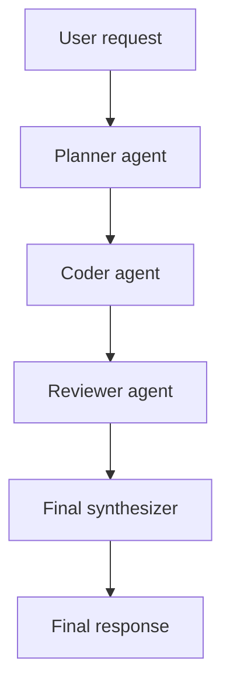

# LangGraph + CopilotKit (Lando)

A local AI development stack: **LangGraph** graphs powered by **Ollama**, exposed through a **Django** AG-UI API, and surfaced in a **CopilotKit** React/NextJS frontend — all orchestrated by Lando with no cloud licensing required. Uses MCP filesystem for read/write capabilities, and is configurable via Django and file editing. 
Users can configure and select multiple graphs, multiple agents (and agentic swarms), and can view graph shape via Python and Mermaid chart.
Any Ollama capable model can be loaded on startup to respond to agents, base configured with Qwen for constrained model size/functionality tradeoffs.
Services are Dockerfile configured and exposed via Lando as a multi-endpoint capable system (I prefer using names for services instead of port names). You should easily be able to strip out the Lando toolset and just run this in Docker if you want.
Agents are enabled to read-write to the filesystem for advanced coding toolchains.

## What can this project do for you?

If you don't want to pay for an LLM API and have GPU to spare, and you're interested in orchestrating multiple agents using locally running LLMs, but you want a chatty web interface to "talk" to your agent swarms and not a boring IDE . . . (and you want to use a graph-defined state machine system approach with human in the loop) this could be a great package for you.

## Why?

I wanted to be able to spin up a variety of Ollama-powered multiagent swarm(s) in my home lab that did not consume tokens from external services (no cost model). The existing langgraph/langchain examples were tightly constrained to commercial implementations and depended on third party API services. (This is great if you work in FAANG or someone else is paying the bills, but not very useful if you want to work with langgraph and don't want to worry about exceeding token costs.)
I wanted something flexible and chatty, and potentially something that I could leave running for a while to build a tool, app, or methodology without any costs other than electricity and local compute.

## What is LangGraph?
LangGraph is an open-source framework for building and managing complex AI workflows using graph-based structures, enabling multi-agent orchestration and stateful interactions.
What is LangGraph?
LangGraph is a library within the LangChain ecosystem designed to orchestrate multiple Large Language Model (LLM) agents or chains in a structured, flexible, and scalable manner. Unlike traditional linear pipelines, LangGraph represents workflows as graphs, where nodes correspond to tasks or agents and edges define the flow of execution. This graph-based approach allows developers to create cyclical, branching, and parallel workflows, making it ideal for complex, decision-driven applications.
LangGraph extends LangChain by enabling stateful, multi-actor applications, where each agent can maintain context, interact with other agents, and update the workflow dynamically. It is MIT-licensed and open-source, allowing free use and integration into production systems

## What are LangGraph's Advantages over single-agent workflows?
Flexible and Scalable: Supports complex, multi-step workflows with branching and loops.
Stateful Interactions: Maintains context across multiple agents and sessions.
Debugging and Monitoring: Tools like LangSmith allow developers to inspect agent decisions and optimize workflows.
Multi-Agent Coordination: Enables orchestration of multiple LLMs or tools in a single workflow.
In essence, LangGraph transforms AI workflows into graph-based, stateful, and orchestrated systems, making it easier to build robust, scalable, and intelligent applications that go beyond simple linear pipelines.

## Architecture

```
Browser
  └─▶ langgraph.lndo.site          (Next.js :3000  — CopilotKit UI)
        └─▶ /api/copilotkit/*       (CopilotKit Runtime — Next.js API route)
              └─▶ django:8080       (Django AG-UI streaming endpoint)
                    └─▶ ollama:11434 (Ollama LLM)
```

Additional services:

| URL | Service | Purpose |
|-----|---------|---------|
| `langgraph.lndo.site` | `frontend` | React chat UI with graph + project profile selectors |
| `api.langgraph.lndo.site` | `django` | AG-UI + REST API |
| `langgraph-api.lndo.site` | `appserver` | Raw LangGraph dev server |
| `mcpfs.langgraph.lndo.site` | `mcp-filesystem` | Streamable HTTP MCP filesystem tools (sandboxed) |
| `charts.langgraph.lndo.site` | `charts` | Mermaid chart viewer |

> **Note:** `.lndo.site` DNS may be blocked by system security policy. Use `lando info` to get the `localhost` port for each service.

---

## Quick start

### Host prerequisite for NVIDIA GPU

If you want Ollama to run with CUDA acceleration, install the NVIDIA Container Toolkit on the Docker host before starting the stack. This project now requests `gpus: all` for the Ollama container, so Docker must already be configured to expose the NVIDIA runtime.

### 1. Start all services

```bash
lando start
```

### 2. Pull the Ollama model (once)

```bash
lando pull-model
```

Or use the helper script:

```bash
./scripts/pull-model.sh
```

### 3. Open the browser UI

```
http://langgraph.lndo.site
```

The CopilotKit chat sidebar opens automatically. Use the **Agent** dropdown in the header to switch between graphs.

Use the **Profile** dropdown to switch project contexts (allowed graphs + tool mode), and the **Filesystem** dropdown to pick the active filesystem root for this chat run.

### Frontend import note

Next.js 15 rejects the `@copilotkit/react-core/v2` barrel inside client boundaries because the package's `dist/v2/index.mjs` uses `export *`.

Use the package-root `@copilotkit/react-core` import for the top-level app shell provider in `frontend/app/layout.tsx`, and use `@copilotkit/react-core/v2/headless` for the agent-aware hooks and configuration provider in client components.

The hook-based pieces you can rely on are:

- `CopilotChatConfigurationProvider`
- `useCopilotChatConfiguration`
- `useAgent`

That split keeps the frontend build working while still letting the selected graph flow through the chat configuration layer.

### CopilotKit handshake note

The Next.js runtime exposes both of these routes:

- `POST /api/copilotkit` for the single-endpoint CopilotKit handshake
- `GET /api/copilotkit/info` for REST-style runtime discovery

If the browser shows `runtime_info_fetch_failed`, make sure the root route exists and restart the frontend dev server after clearing any stale `.next` cache.

### 4. Stop

```bash
lando stop
```

### 5. Rebuild after dependency changes

```bash
lando rebuild -y
```

---

## Currently Available graphs

| Graph ID | Description |
|----------|-------------|
| `basic` | ReAct chat agent backed by Ollama with MCP filesystem tools |
| `swarm_v1` | Multi-agent chat pipeline with MCP filesystem tool access |

---

## Dynamic runtime agent registration (Django-driven)

The frontend CopilotKit runtime discovers registered agents dynamically from Django.

- Source of truth for chat-ready agent IDs is `GET /api/graphs/` on Django.
- Django now builds `GET /api/graphs/` dynamically from `langgraph.json` (plus dynamic graph imports).
- Next.js runtime fetches this list and builds `HttpAgent` registrations automatically.
- You do not need to edit frontend runtime agent maps when adding a new graph ID.
- Runtime keeps a short in-memory cache (`COPILOTKIT_RUNTIME_CACHE_MS`, default `5000`) to avoid rebuilding on every request.
- Runtime discovery uses a short timeout (`COPILOTKIT_DISCOVERY_TIMEOUT_MS`, default `800`) and falls back to baseline agents if Django is temporarily unavailable.

Operationally, graph onboarding is now declarative in `langgraph.json` + graph source files, with Django and frontend runtime following automatically.

In mixed local runtimes, Django auto-discovers `langgraph.json` from known container paths (Compose and Lando layouts).

---

## Django graph operations guide

This section is the detailed workflow for adding, exposing, and validating new graphs through Django.

### 1. Add or update graph implementation in `src/`

Create a graph module under `src/` that exports a compiled `graph` object.

Example layout:

```text
src/
  my_graph/
    __init__.py
    graph.py
```

### 2. Register graph in `langgraph.json` (declarative source of truth)

Add the graph ID to the `graphs` object so appserver tooling recognizes it.

```json
{
  "graphs": {
    "basic": "./src/basic_graph/graph.py:graph",
    "swarm_v1": "./src/swarm_graph/graph.py:graph",
    "my_graph": "./src/my_graph/graph.py:graph"
  }
}
```

### 3. Add graph description metadata (optional but recommended)

Add a friendly description in `django/graph_descriptions.json`:

```json
{
  "my_graph": "Purpose-built graph for <your workflow>."
}
```

If omitted, Django returns a generic description.

### 4. Ensure profile access to the graph

Update `django/project_profiles.json` and include `my_graph` in one or more profile `allowed_graphs` arrays.

### 5. (Optional) Configure multiple filesystem targets per profile

Each profile can declare multiple filesystem locations:

```json
{
  "id": "webapp-qa",
  "filesystem_roots": [
    "/workspace-data/webapps/site-a",
    "/workspace-data/webapps/site-b"
  ],
  "default_graph": "swarm_v1",
  "allowed_graphs": ["swarm_v1", "my_graph"],
  "tool_mode": "read_only"
}
```

The frontend lets you pick one active root; that active root is sent to the runtime as system context.

Once this is done:

- `GET /api/graphs/` returns the new ID.
- Next.js runtime will discover and register it automatically.
- It becomes selectable in the frontend graph selector without editing runtime code.

### 6. Validate from Django container

Use Django container tooling:

```bash
lando django check
lando ssh -s django -c "curl -s http://localhost:8080/api/graphs/"
lando ssh -s django -c "curl -s http://localhost:8080/api/projects/"
```

### 7. Validate from frontend runtime

From the frontend container:

```bash
lando ssh -s frontend -c "curl -s http://localhost:3000/api/copilotkit/info"
```

Check that `agents` includes your newly added graph ID.

### 8. Rebuild/restart rules

- If you changed only Python source under mounted volumes: restart services if needed for clean state.
- If you changed dependencies (`requirements.txt`, `django/requirements.txt`, frontend deps): run `lando rebuild -y`.

---

## Django API endpoints used for dynamic registration

- `GET /api/health/`: health status and known graph IDs.
- `GET /api/graphs/`: authoritative graph IDs for frontend runtime dynamic registration.
- `GET /api/projects/`: project profile definitions (filesystem root, allowed graphs, tool mode).
- `POST /api/agents/<graph_id>/`: AG-UI streaming run endpoint for the selected graph.

---

## Directing agents across graphs and filesystem locations

Use this simple routing model:

1. Pick a **Profile** in the UI (defines allowed graphs + available filesystem roots).
2. Pick an **Agent** (graph) from profile-allowed options.
3. Pick an explicit **Filesystem** root for this run.

This gives clear intent per conversation turn:

- Which graph behavior is used.
- Which local filesystem location the model should focus on.
- Whether the run is read-only or read-write (`tool_mode`).

Recommended convention:

- Keep one profile per project or environment (for example `site-a-dev`, `site-a-qa`, `site-b-perf`).
- Use narrow `allowed_graphs` per profile.
- Use read-only `tool_mode` for testing/review flows, then switch to read-write profiles only when you intend to modify files.

---

## Tooling commands

```bash
# Frontend (Next.js)
lando npm install
lando npm run build
lando npx <command>

# Django API
lando django shell
lando django migrate
lando pip install <package>
lando python <script>

# Ollama model management
lando pull-model
lando ollama list

# MCP filesystem service
lando mcpfs-shell

# CLI graph runner (bypasses the UI)
lando graph basic "Write a hello world in Rust"
lando graph swarm_v1 "Design a secure file upload endpoint in FastAPI"
```

## Shell access mapping (Lando vs Docker)

Use the container shell for app commands. Do not run project `npm`, `python`, `pip`, `manage.py`, or `ollama` commands in the host shell.

| Area | Lando shell | Docker shell |
|------|-------------|--------------|
| Frontend (`frontend/`) | `lando ssh -s frontend` | `docker exec -it langgraph-frontend sh` |
| Django API (`django/`) | `lando ssh -s django` | `docker exec -it langgraph-django sh` |
| LangGraph runner (`run_graph.py`, `src/`) | `lando ssh -s appserver` | `docker exec -it langgraph-dev sh` |
| Ollama service | `lando ssh -s ollama` | `docker exec -it ollama sh` |
| MCP filesystem | `lando ssh -s mcp-filesystem` | `docker exec -it langgraph-mcp-filesystem sh` |
| Chart viewer (nginx) | `lando ssh -s charts` | `docker exec -it langgraph-charts sh` |

Examples:

```bash
# Lando: run Django migrations inside django service
lando ssh -s django -c "python manage.py migrate"

# Docker: run frontend install inside frontend container
docker exec -it langgraph-frontend sh -lc "npm install"

# Docker: run graph CLI in langgraph container
docker exec -it langgraph-dev sh -lc "python run_graph.py basic 'hello'"
```

If unsure where to run a command:

1. Pick the service that owns the code/runtime.
2. Enter that service shell with `lando ssh -s <service>` or `docker exec -it <container> sh`.
3. Run the command there, not on the host.

---

## CLI graph runner (no browser needed)

```bash
./scripts/run-graph.sh <graph_id> "your prompt"
```

`run-graph.sh` auto-detects the current Lando appserver localhost URL.

```bash
./scripts/run-graph.sh basic "Write a short hello world in Python"
./scripts/run-graph.sh swarm_v1 "Design a secure file upload endpoint in FastAPI"
```

Override the URL manually:

```bash
BASE_URL=http://localhost:<PORT> ./scripts/run-graph.sh swarm_v1 "your prompt"
```

---

## Mermaid chart viewer

Generate a PNG from the Mermaid block in this README:

```bash
./scripts/render-mermaid-png.sh
```

One-command preview loop (regen + open + auto-refresh):

```bash
./scripts/preview-chart-loop.sh
```

This writes `public/swarm-chart.png` and serves it at `charts.langgraph.lndo.site` (or `http://localhost:8124` with Docker Compose).

---

## Docker Compose (without Lando)

```bash
docker compose up --build
```

Port mapping:

| Port | Service |
|------|---------|
| 3000 | Next.js frontend |
| 8080 | Django API |
| 8765 | MCP filesystem (Streamable HTTP `/mcp`) |
| 8123 | LangGraph dev server |
| 8124 | Chart viewer |
| 11434 | Ollama |

---

## Swarm graph flow



Each node has one job — planner breaks down the task, coder drafts the implementation, reviewer checks for issues, writer synthesises the final answer.

---

## Ollama model storage

Models are stored on the host at `~/.ollama` and persist across rebuilds and container restarts.

## MCP filesystem security model

The MCP filesystem server is sandboxed to `workspace-data/` on the host (`/workspace-data` in container).

- Agents can only operate on paths inside this sandbox.
- Path traversal (`../`) is blocked server-side.
- Set `MCP_FILESYSTEM_READ_ONLY=true` to enforce read-only mode.
- `MCP_FILESYSTEM_MAX_READ_BYTES` limits single-file read size (default: 1 MiB).

To let agents use a different writable root, change the `MCP_FILESYSTEM_ROOT` env var and corresponding volume mount in `docker-compose.yml` and `.lando.yml`.

---

## Why not `langchain/langgraph-api:latest-py3.12`?

That image requires `LANGSMITH_API_KEY` or `LANGGRAPH_CLOUD_LICENSE_KEY`. This repo uses a local `langgraph dev` runtime so you can run immediately without cloud licensing.

---

## Project structure

```
.lando.yml                   Lando service definitions + proxy + tooling
docker-compose.yml           Equivalent Docker Compose stack
Dockerfile                   LangGraph dev server image
langgraph.json               Graph ID → module path mappings
mcp-filesystem/              Streamable HTTP MCP filesystem server

frontend/                    Next.js + CopilotKit
  app/
    layout.tsx               CopilotKit provider (points at /api/copilotkit)
    page.tsx                 Chat UI with graph + profile + filesystem selectors
    api/copilotkit/
      runtime.mjs            CopilotKit Runtime — dynamic agent registration from Django
      [...path]/route.ts     CopilotKit Runtime route — proxies to Django
  Dockerfile

django/                      Django AG-UI API
  agents/
    views.py                 AG-UI SSE endpoint + health + graph list
    urls.py
  graph_descriptions.json    Optional graph description registry
  project_profiles.json      Startup project profile registry
  langgraph_api/
    settings.py
    asgi.py                  ASGI entry point (uvicorn)
  Dockerfile

src/
  basic_graph/graph.py       Ollama ReAct graph with MCP filesystem tools
  swarm_graph/graph.py       Multi-agent swarm graph

scripts/
  run-graph.sh               CLI runner for any graph ID
  pull-model.sh              Pull the Ollama model
  render-mermaid-png.sh      Render Mermaid diagrams to PNG
  preview-chart-loop.sh      Live-preview loop for chart PNG
```