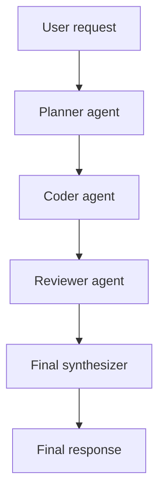

# LangGraph + CopilotKit (Lando)

A local AI development stack: **LangGraph** graphs powered by **Ollama**, exposed through a **Django** AG-UI API, and surfaced in a **CopilotKit** React frontend — all orchestrated by Lando with no cloud licensing required.

## Architecture

```
Browser
  └─▶ langgraph.lndo.site          (Next.js :3000  — CopilotKit UI)
        └─▶ /api/copilotkit/*       (CopilotKit Runtime — Next.js API route)
              └─▶ django:8080       (Django AG-UI streaming endpoint)
                    └─▶ ollama:11434 (Ollama LLM)
```

Additional services:

| URL | Service | Purpose |
|-----|---------|---------|
| `langgraph.lndo.site` | `frontend` | React chat UI with graph selector |
| `api.langgraph.lndo.site` | `django` | AG-UI + REST API |
| `langgraph-api.lndo.site` | `appserver` | Raw LangGraph dev server |
| `charts.langgraph.lndo.site` | `charts` | Mermaid chart viewer |

> **Note:** `.lndo.site` DNS may be blocked by system security policy. Use `lando info` to get the `localhost` port for each service.

---

## Quick start

### 1. Start all services

```bash
lando start
```

### 2. Pull the Ollama model (once)

```bash
lando pull-model
```

Or use the helper script:

```bash
./scripts/pull-model.sh
```

### 3. Open the browser UI

```
http://langgraph.lndo.site
```

The CopilotKit chat sidebar opens automatically. Use the **Agent** dropdown in the header to switch between graphs.

### Frontend import note

Next.js 15 rejects the `@copilotkit/react-core/v2` barrel inside client boundaries because the package's `dist/v2/index.mjs` uses `export *`.

Use the package-root `@copilotkit/react-core` import for the top-level app shell provider in `frontend/app/layout.tsx`, and use `@copilotkit/react-core/v2/headless` for the agent-aware hooks and configuration provider in client components.

The hook-based pieces you can rely on are:

- `CopilotChatConfigurationProvider`
- `useCopilotChatConfiguration`
- `useAgent`

That split keeps the frontend build working while still letting the selected graph flow through the chat configuration layer.

### CopilotKit handshake note

The Next.js runtime exposes both of these routes:

- `POST /api/copilotkit` for the single-endpoint CopilotKit handshake
- `GET /api/copilotkit/info` for REST-style runtime discovery

If the browser shows `runtime_info_fetch_failed`, make sure the root route exists and restart the frontend dev server after clearing any stale `.next` cache.

### 4. Stop

```bash
lando stop
```

### 5. Rebuild after dependency changes

```bash
lando rebuild -y
```

---

## Available graphs

| Graph ID | Description |
|----------|-------------|
| `basic` | Single-node chat agent backed by Ollama |
| `swarm_v1` | Multi-agent pipeline: planner → coder → reviewer → writer |

---

## Tooling commands

```bash
# Frontend (Next.js)
lando npm install
lando npm run build
lando npx <command>

# Django API
lando django shell
lando django migrate
lando pip install <package>
lando python <script>

# Ollama model management
lando pull-model
lando ollama list

# CLI graph runner (bypasses the UI)
lando graph basic "Write a hello world in Rust"
lando graph swarm_v1 "Design a secure file upload endpoint in FastAPI"
```

## Shell access mapping (Lando vs Docker)

Use the container shell for app commands. Do not run project `npm`, `python`, `pip`, `manage.py`, or `ollama` commands in the host shell.

| Area | Lando shell | Docker shell |
|------|-------------|--------------|
| Frontend (`frontend/`) | `lando ssh -s frontend` | `docker exec -it langgraph-frontend sh` |
| Django API (`django/`) | `lando ssh -s django` | `docker exec -it langgraph-django sh` |
| LangGraph runner (`run_graph.py`, `src/`) | `lando ssh -s appserver` | `docker exec -it langgraph-dev sh` |
| Ollama service | `lando ssh -s ollama` | `docker exec -it ollama sh` |
| Chart viewer (nginx) | `lando ssh -s charts` | `docker exec -it langgraph-charts sh` |

Examples:

```bash
# Lando: run Django migrations inside django service
lando ssh -s django -c "python manage.py migrate"

# Docker: run frontend install inside frontend container
docker exec -it langgraph-frontend sh -lc "npm install"

# Docker: run graph CLI in langgraph container
docker exec -it langgraph-dev sh -lc "python run_graph.py basic 'hello'"
```

If unsure where to run a command:

1. Pick the service that owns the code/runtime.
2. Enter that service shell with `lando ssh -s <service>` or `docker exec -it <container> sh`.
3. Run the command there, not on the host.

---

## CLI graph runner (no browser needed)

```bash
./scripts/run-graph.sh <graph_id> "your prompt"
```

`run-graph.sh` auto-detects the current Lando appserver localhost URL.

```bash
./scripts/run-graph.sh basic "Write a short hello world in Python"
./scripts/run-graph.sh swarm_v1 "Design a secure file upload endpoint in FastAPI"
```

Override the URL manually:

```bash
BASE_URL=http://localhost:<PORT> ./scripts/run-graph.sh swarm_v1 "your prompt"
```

---

## Mermaid chart viewer

Generate a PNG from the Mermaid block in this README:

```bash
./scripts/render-mermaid-png.sh
```

One-command preview loop (regen + open + auto-refresh):

```bash
./scripts/preview-chart-loop.sh
```

This writes `public/swarm-chart.png` and serves it at `charts.langgraph.lndo.site` (or `http://localhost:8124` with Docker Compose).

---

## Docker Compose (without Lando)

```bash
docker compose up --build
```

Port mapping:

| Port | Service |
|------|---------|
| 3000 | Next.js frontend |
| 8080 | Django API |
| 8123 | LangGraph dev server |
| 8124 | Chart viewer |
| 11434 | Ollama |

---

## Swarm graph flow



Each node has one job — planner breaks down the task, coder drafts the implementation, reviewer checks for issues, writer synthesises the final answer.

---

## Ollama model storage

Models are stored on the host at `~/.ollama` and persist across rebuilds and container restarts.

---

## Why not `langchain/langgraph-api:latest-py3.12`?

That image requires `LANGSMITH_API_KEY` or `LANGGRAPH_CLOUD_LICENSE_KEY`. This repo uses a local `langgraph dev` runtime so you can run immediately without cloud licensing.

---

## Project structure

```
.lando.yml                   Lando service definitions + proxy + tooling
docker-compose.yml           Equivalent Docker Compose stack
Dockerfile                   LangGraph dev server image
langgraph.json               Graph ID → module path mappings

frontend/                    Next.js + CopilotKit
  app/
    layout.tsx               CopilotKit provider (points at /api/copilotkit)
    page.tsx                 Chat UI with graph selector
    api/copilotkit/
      [...path]/route.ts     CopilotKit Runtime — proxies to Django
  Dockerfile

django/                      Django AG-UI API
  agents/
    views.py                 AG-UI SSE endpoint + health + graph list
    urls.py
  langgraph_api/
    settings.py
    asgi.py                  ASGI entry point (uvicorn)
  Dockerfile

src/
  basic_graph/graph.py       Ollama-backed single-node chat graph
  swarm_graph/graph.py       Multi-agent swarm graph

scripts/
  run-graph.sh               CLI runner for any graph ID
  pull-model.sh              Pull the Ollama model
  render-mermaid-png.sh      Render Mermaid diagrams to PNG
  preview-chart-loop.sh      Live-preview loop for chart PNG
```